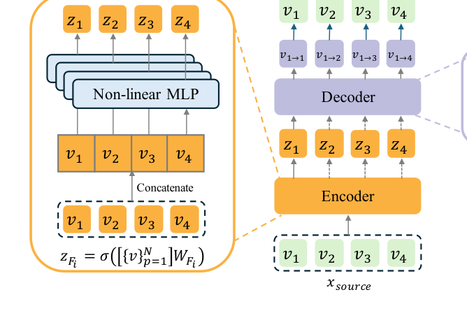
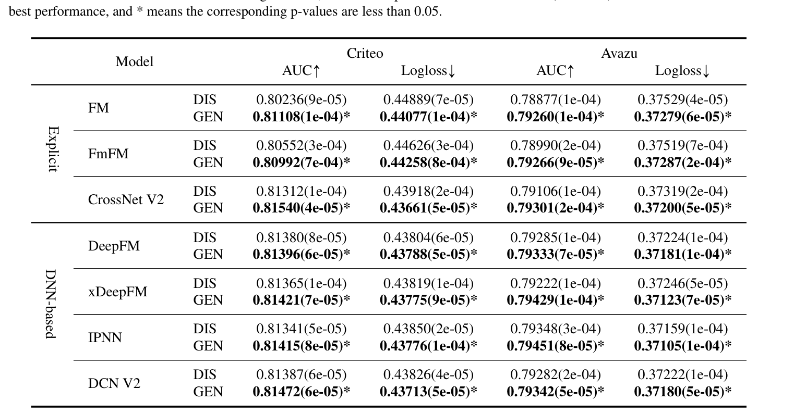
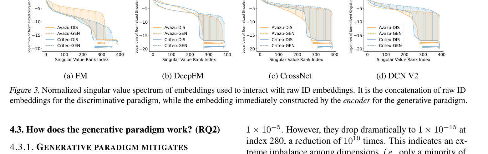
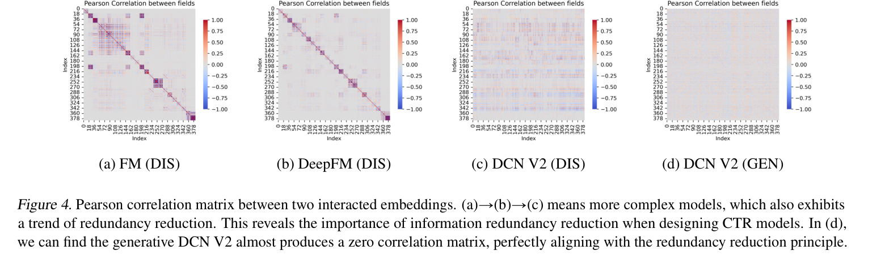

# From Feature Interaction to Feature Generation

[](https://ustc-starteam.github.io/GE4Rec/)
[](https://icml.cc/)
[](https://github.com/reczoo/FuxiCTR)

Official code for **"From Feature Interaction to Feature Generation: A Generative Paradigm of CTR Prediction Models"**.

This repository implements **Supervised Feature Generation (SFG)**, a generative reformulation for click-through rate prediction models. Instead of relying only on discriminative interactions among raw ID embeddings, SFG learns an encoder-decoder process that generates feature representations under supervised CTR labels and can be integrated into existing CTR backbones.

## 1. Paper

Mingjia Yin, Junwei Pan, Hao Wang, Ximei Wang, Shangyu Zhang, Jie Jiang, Defu Lian, and Enhong Chen. **From Feature Interaction to Feature Generation: A Generative Paradigm of CTR Prediction Models.** In *Proceedings of the 42nd International Conference on Machine Learning (ICML 2025)*, PMLR 267, 2025.

[Paper](https://arxiv.org/abs/2512.14041) / [PDF](https://arxiv.org/pdf/2512.14041) / [Project Page](https://ustc-starteam.github.io/GE4Rec/) / [Citation](#citation)

GE4Rec introduces Supervised Feature Generation for CTR prediction. It shifts existing CTR models from discriminative feature interaction toward a generative feature representation paradigm, reducing embedding collapse and information redundancy while preserving compatibility with common FuxiCTR-style backbones.

## 2. Highlights

- Reframes CTR prediction from **feature interaction** to **feature generation**.
- Adds a supervised encoder-decoder path that mitigates embedding dimensional collapse and information redundancy.
- Generalizes across common FuxiCTR-style backbones, including FM, FmFM, CrossNet V2, DeepFM, xDeepFM, IPNN, and DCN V2.
- Includes scripts for dataset preparation, model reproduction, embedding extraction, and paper-style analysis plots.

## 3. Method At A Glance



SFG constructs hidden embeddings with an encoder and uses a decoder to regenerate feature embeddings. The generated representations are then consumed by the downstream CTR interaction module and optimized with supervised click labels, making the generative paradigm compatible with existing CTR models.

## 4. Repository Structure

```text
.
|-- fuxictr/                         # Local FuxiCTR-based framework code
|-- model_zoo/                       # CTR model configs, sources, and experiment entry points
|-- 1.prepare.sh                     # Download and prepare Avazu/Criteo datasets
|-- 2.reproduce.sh                   # Train discriminative and generative variants
|-- 3.analyze.sh                     # Extract embeddings and plot paper analyses
|-- analyze.py                       # Inference-time embedding extraction
|-- plot_paper_*.py                  # Visualization scripts for paper diagnostics
|-- requirements.txt
|-- docs/assets/                     # README figures cropped from the paper
`-- README.md
```

## 5. Installation

```bash
conda create -n GE4Rec python=3.10 -y
conda activate GE4Rec
pip install torch torchvision torchaudio
pip install -r requirements.txt
```

The code is implemented on top of [FuxiCTR](https://github.com/reczoo/FuxiCTR). Use a CUDA-enabled environment for full reproduction.

## 6. Data

Download the Avazu and Criteo datasets used by the reproduction scripts:

```bash
bash 1.prepare.sh
```

The script downloads the FuxiCTR-format archives from Hugging Face and extracts them into:

```text
data/Avazu/avazu_x4_3bbbc4c9/
data/Criteo/criteo_x1_7b681156/
```

After the first run, FuxiCTR may generate parquet files. For faster follow-up runs, update the relevant `dataset_config.yaml` entries to use `data_format: parquet`, set `rebuild_dataset: false`, and point `train_data`, `valid_data`, and `test_data` to the generated parquet files.

## 7. Quick Start

The default reproduction script trains DeepFM variants on Avazu:

```bash
bash 2.reproduce.sh
```

Then extract embeddings and generate analysis plots:

```bash
bash 3.analyze.sh
```

Check the GPU IDs inside the scripts before running. The default scripts use GPU `3` for Avazu and GPU `0` for Criteo analysis commands.

## 8. Reproducing Paper Results

The paper compares discriminative (`DIS`) and generative (`GEN`) variants across multiple CTR backbones. To switch models, edit the `model_name` variable in:

```bash
2.reproduce.sh
3.analyze.sh
```

Each model's experiment definitions live under `model_zoo/<ModelName>/config/`. For example, DCN V2 includes the generative implementation and embedding-recording hooks used by the analysis scripts.

## 9. Analysis Hooks

Embedding analysis relies on model-side recording hooks. Register embeddings in an `init_record` method with names like `record_feature_emb`, and append detached CPU tensors during `forward` when `self.analyzing` is enabled. See `model_zoo/DCNv2/src/DCNv2.py` for the existing pattern.

## 10. Experimental Highlights



Across Avazu and Criteo, the generative paradigm consistently improves AUC and Logloss for multiple CTR backbones, showing that the SFG formulation is not tied to one specific interaction architecture.



The embedding spectrum analysis shows that SFG mitigates dimensional collapse by maintaining a healthier distribution of singular values.



Correlation analysis shows that the generative formulation reduces redundancy between interacted embeddings, which supports the paper's explanation for the observed performance gains.

## 11. Notes For Maintainers

- Keep FuxiCTR-compatible configs and scripts aligned when adding a new model.
- If a model is used for analysis, make sure the embedding-recording hooks are registered before running `3.analyze.sh`.
- Keep README figures under `docs/assets/`; generated experiment outputs should remain in their experiment folders.

<a id="citation"></a>

## 12. Citation

```bibtex
@inproceedings{yin2025feature,
  title = {From Feature Interaction to Feature Generation: A Generative Paradigm of CTR Prediction Models},
  author = {Yin, Mingjia and Pan, Junwei and Wang, Hao and Wang, Ximei and Zhang, Shangyu and Jiang, Jie and Lian, Defu and Chen, Enhong},
  booktitle = {Proceedings of the 42nd International Conference on Machine Learning},
  series = {Proceedings of Machine Learning Research},
  volume = {267},
  year = {2025}
}
```

## 13. Contact

For paper questions, contact Hao Wang at `wanghao3@ustc.edu.cn`. For repository issues, please open a GitHub issue in this repository.
